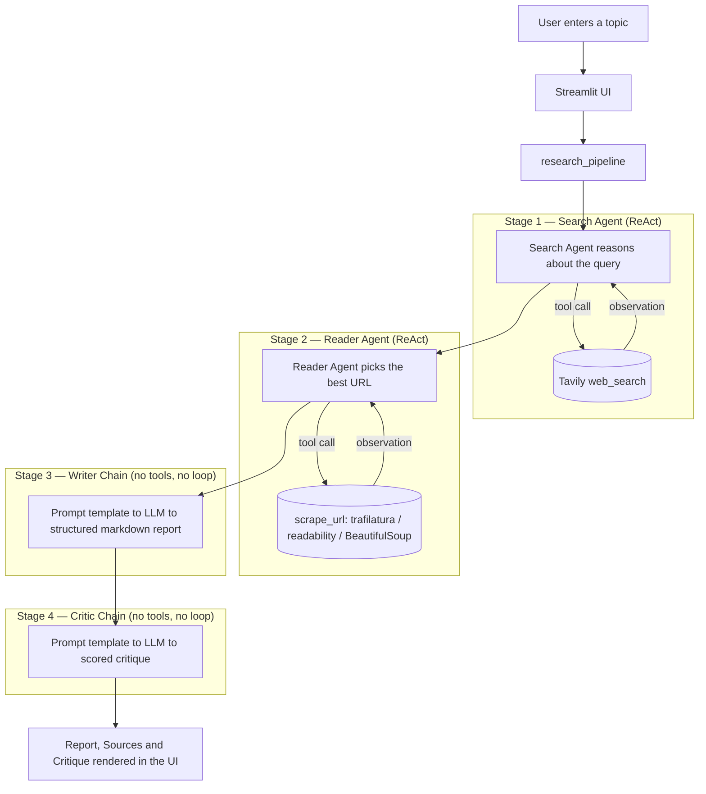

# Research Desk

A multi-agent research assistant that takes a topic, searches the web, reads the most relevant source in depth, drafts a structured report, and critiques its own output — all through a set of coordinating LangChain agents and chains, wrapped in a custom Streamlit interface.

Live demo: <!-- add deployed link here -->

---

## Why this project exists

This is a learning milestone from my agentic AI path, built specifically to understand and implement the **ReAct (Reason + Act) pattern** rather than just calling an LLM in a loop.

Two of the four stages in this pipeline are true ReAct agents — the model reasons about what it needs, decides whether to call a tool, observes the result, and decides again whether it has enough information or needs another tool call. The other two stages are plain LLM chains (prompt in, structured text out) with no tool access and no reasoning loop. Building both side by side, in the same pipeline, was the point: it's the clearest way to see where an agent is actually necessary and where a chain is simpler, cheaper, and just as effective.

What this project forced me to work through:
- The actual mechanics of a ReAct loop — tool schemas, tool-call messages, tool results being fed back into the model's context, and the model deciding when to stop.
- Where multi-agent orchestration earns its complexity versus where a single well-prompted chain is enough.
- State handoff between independent agent invocations (each agent here is a fresh `create_agent()` call — there's no shared memory beyond what's explicitly passed forward).
- Building a UI that reflects an asynchronous, multi-stage backend process honestly, instead of hiding everything behind one generic spinner.

---

## Architecture



The Search and Reader agents are genuine ReAct agents built with LangChain's `create_agent`, each holding a single tool (`web_search` and `scrape_url` respectively). The Writer and Critic stages are `ChatPromptTemplate | llm | StrOutputParser` chains with no tool access — they only ever see text that's already been gathered for them.

---

## Pipeline stages

| Stage | Type | Responsibility |
|---|---|---|
| Search | ReAct agent | Queries Tavily for recent, reliable sources on the topic |
| Read | ReAct agent | Picks the most relevant URL from the search results and scrapes it for deeper content, falling back across three extraction strategies (trafilatura → readability → raw BeautifulSoup) |
| Write | LLM chain | Synthesizes the search results and scraped content into a structured markdown report (introduction, key findings, conclusion, sources) |
| Critique | LLM chain | Scores the report out of 10 and gives specific, structured feedback |

Ground-truth source URLs are extracted directly from the Search agent's tool-call trace (not from the model's own prose), so the Sources tab in the UI reflects what was actually retrieved rather than what the model chose to mention.

---

## Tech stack

- **Orchestration:** LangChain (`create_agent` for ReAct agents, `ChatPromptTemplate` + `StrOutputParser` for chains)
- **LLM:** Google Gemini via `langchain-google-genai`
- **Web search:** Tavily Search API
- **Content extraction:** `trafilatura`, `readability-lxml`, `BeautifulSoup4`, `requests`
- **UI:** Streamlit, with a fully custom design system (no default Streamlit theming) and a live per-stage status rail
- **Report rendering:** `markdown` (Python) for converting the LLM's markdown output into real HTML)
- **Config:** `python-dotenv`

---

## Project structure

```
research_desk/
├── app.py                     # Streamlit UI
├── requirements.txt
├── src/
│   ├── agents/
│   │   └── agents.py          # Agent + chain definitions
│   ├── pipelines/
│   │   └── pipeline.py        # Orchestrates the 4-stage run, exposes on_step callback
│   └── tools/
│       └── tools.py           # web_search (Tavily) and scrape_url tools
└── README.md
```

---

## Setup

**1. Clone and enter the project**
```bash
git clone <your-repo-url>
cd research_desk
```

**2. Create a virtual environment (recommended)**
```bash
conda create -n langagent python=3.11 -y
conda activate langagent
```

**3. Install dependencies**
```bash
pip install -r requirements.txt
```

**4. Set environment variables**

Create a `.env` file in the project root:
```
GOOGLE_API_KEY=your_google_api_key
TAVILY_API_KEY=your_tavily_api_key
```

**5. Run it**
```bash
streamlit run app.py
```

---

## Notes on scope

This is a learning project, not a production research tool. Known limitations worth being upfront about:

- Each agent invocation is stateless relative to the others — there's no shared long-term memory across a session, only the explicit state handed from one stage to the next.
- The Reader agent scrapes exactly one URL per run; it doesn't cross-reference multiple sources.
- There's no caching, so repeated runs on the same topic re-search and re-scrape from scratch.

These are natural next steps rather than oversights, and reflect where the project currently sits in the learning path.
